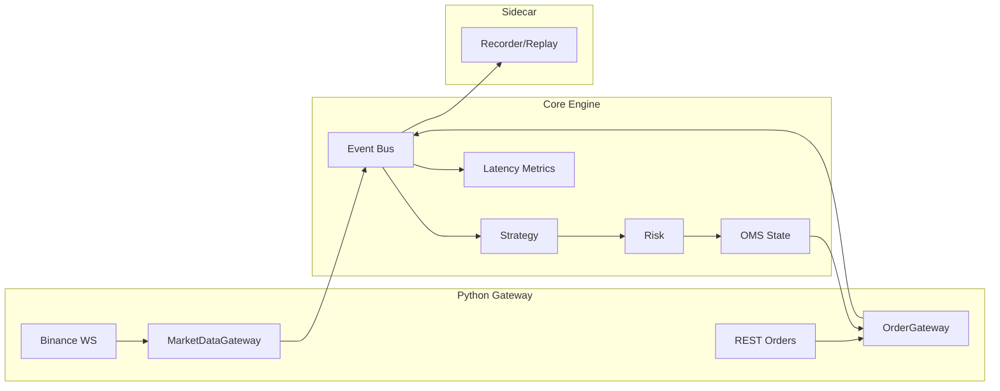
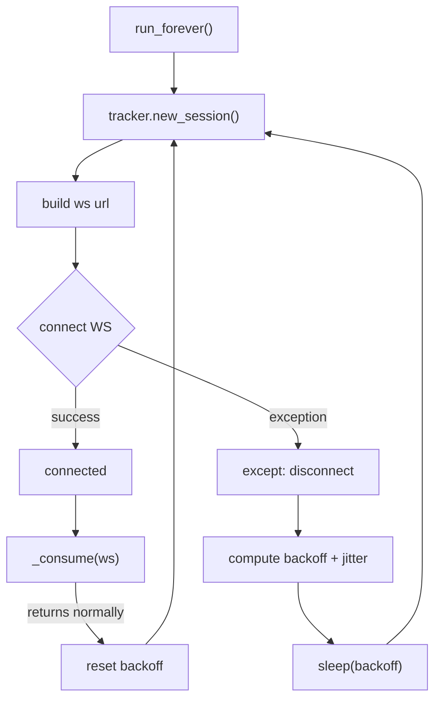
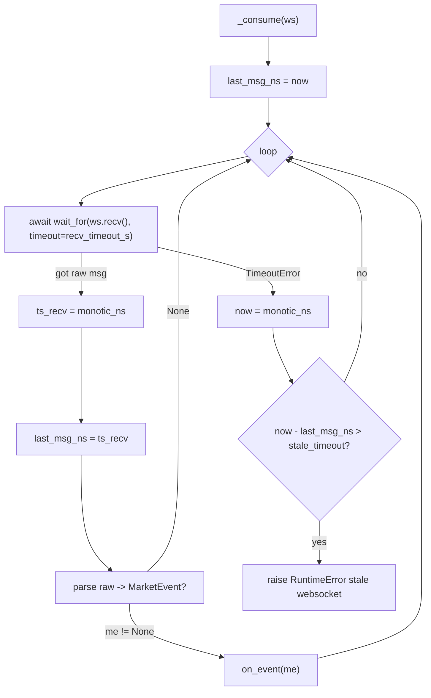
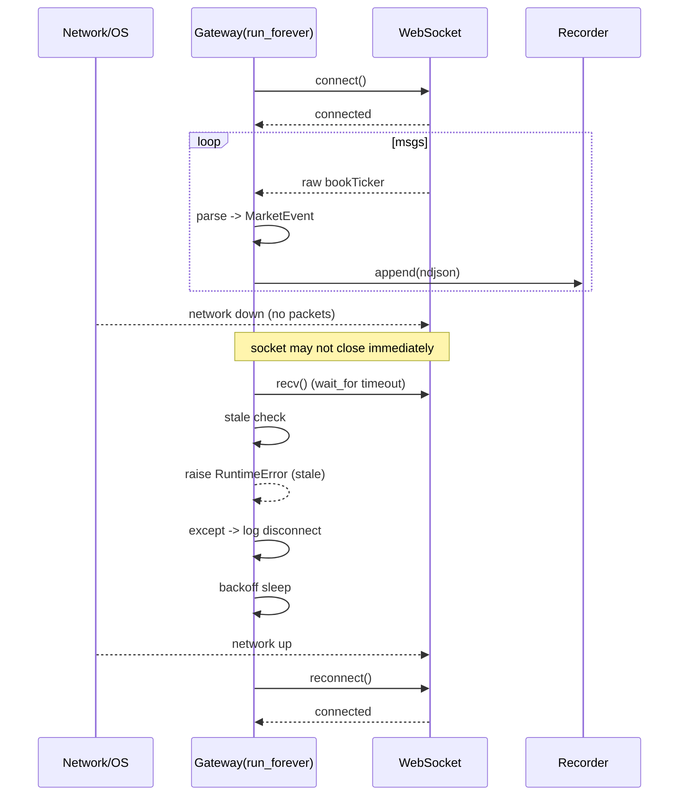

# Crypto Trading System

## 第一步的实现，一个python的crypto交易系统 ---- MVP (Minimum Viable Product)

### 架构图

### 基本组件

1. MarketEvent
2. MarketDataGateway (Binance WS)
3. OrderGateway (REST 下单 + user data stream 回报)
4. EventBus (先用python queue实现)
5. OMS (订单状态机 + intent_id 映射)
6. Risk (max_pos/max_qty/rate_limit)
7. Recorder + Replay (append-only log)
8. Latencty metrics (p50/p99: tick->decision->send->fill)

### MarketEvent

为什么交易系统必须是事件驱动？

1. 交易系统的输入是异步的（行情、回报、风控信号不会同时到）。
2. 事件驱动能够把系统拆成对外部变化的响应，而不是函数调用顺序。
3. 事件是可记录的、可回放的，这是可复现性的基础。
4. 事件模型允许系统在断线、重启后恢复状态。
5. 非事件驱动的系统很难解释“为什么下了这笔单”。

### 骨架 + Recorder

### MarketDataGateway

market data websocket 总流程 flow chart (连接 -->  消费 --> 断线 --> 重连):

_consume 细节

断网事故演练

行情不能假设连续、有序，因为接收到的只是交易所通过网络推送的观察结果。
网络会断、会抖，WebSocket 不保证补发，也不保证顺序。
因此在MarketData Gateway 里，断网重连会导致接收时间戳出现断层，而这并不对应真实市场的停顿。
因此，交易系统只能以事件（event）为基本单位，通过状态机来容忍缺失、乱序和重复，而不能依赖连续、有序的数据假设。

### SimExecution

### 接 user data stream + 真回报 (可选 testnet)

### 风控 + 限速

### 总结

### Appendix A. Logging

为了解释系统行为，打log，但是记录所有发生的事情，log会过多。

开发 MD Gateway 的时候，打log记录：
- connect / connected
- disconnect / reconnect
- warn / error 异常
- session 关键状态变化