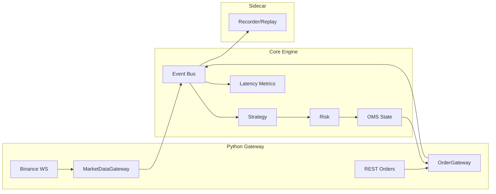

# Crypto Trading System

## 第一步的实现，一个python的crypto交易系统 ---- MVP (Minimum Viable Product)

### 架构图

### 基本组件

1. MarketEvent
2. MarketDataGateway (Binance WS)
3. OrderGateway (REST 下单 + user data stream 回报)
4. EventBus (先用python queue实现)
5. OMS (订单状态机 + intent_id 映射)
6. Risk (max_pos/max_qty/rate_limit)
7. Recorder + Replay (append-only log)
8. Latencty metrics (p50/p99: tick->decision->send->fill)

### MarketEvent

### 骨架 + Recorder

### MarketDataGateway

### SimExecution

### 接 user data stream + 真回报 (可选 testnet)

### 风控 + 限速

### 总结