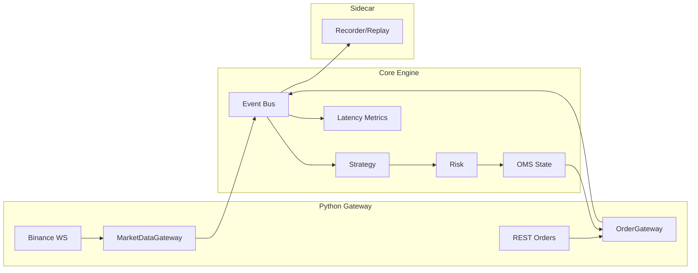
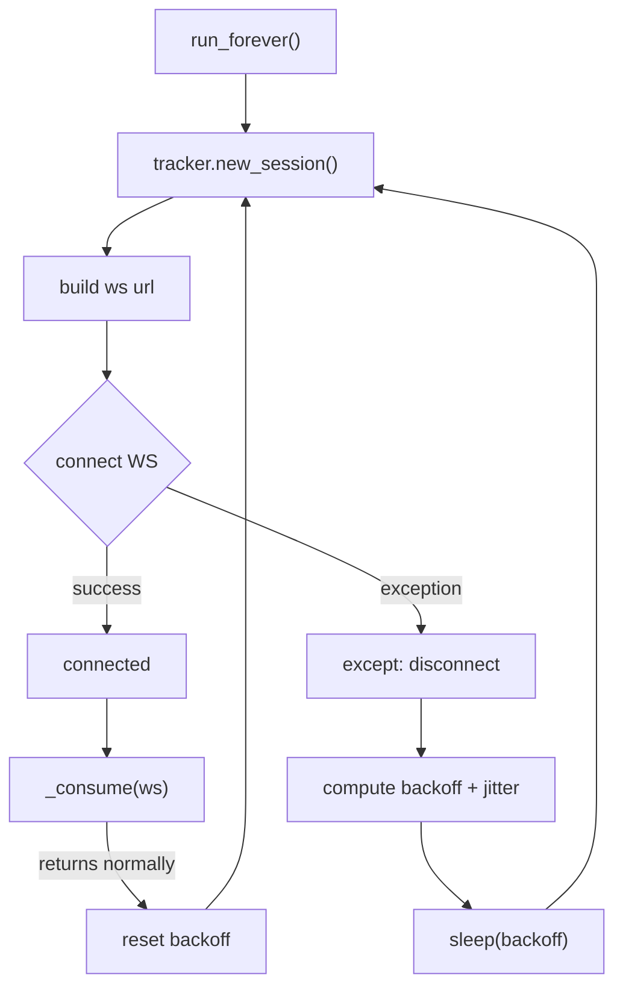
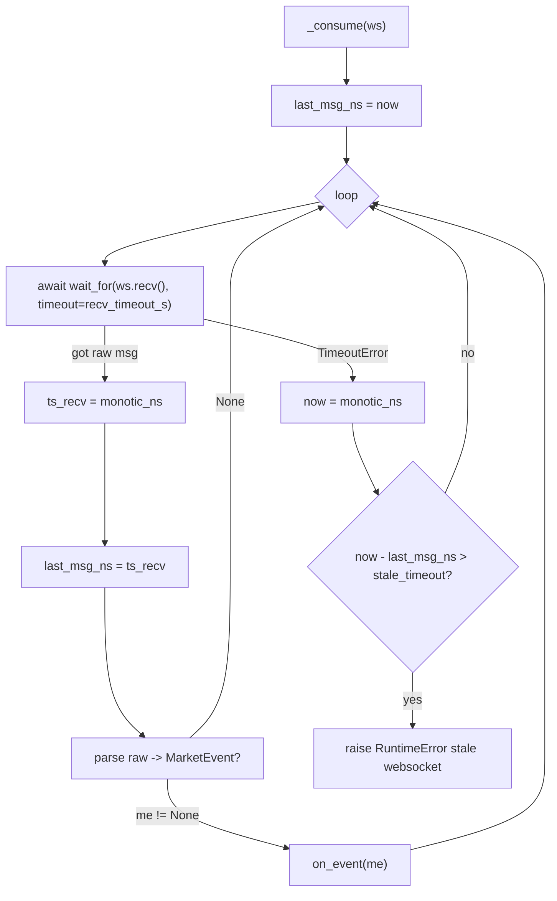
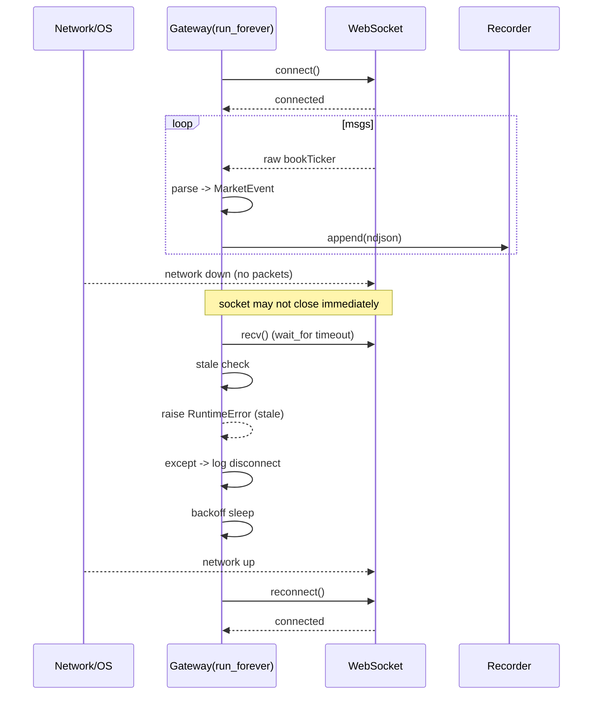
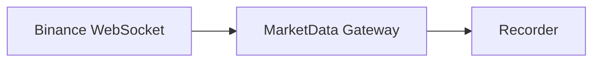
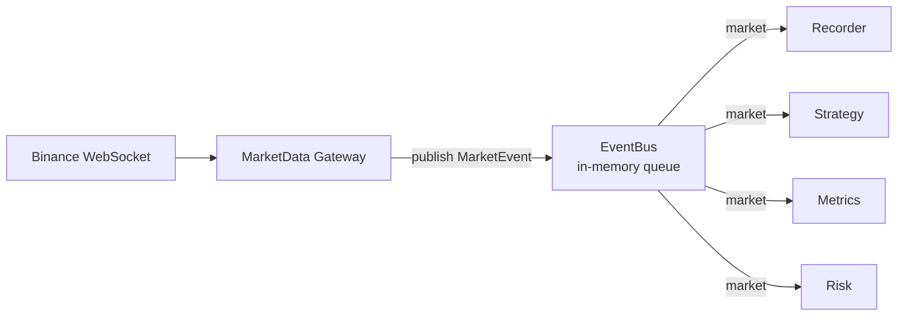
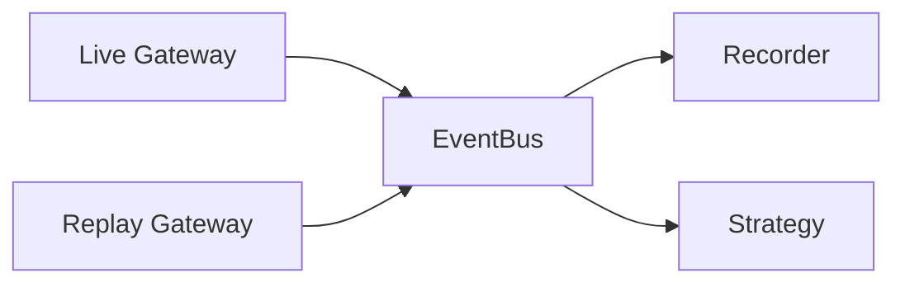
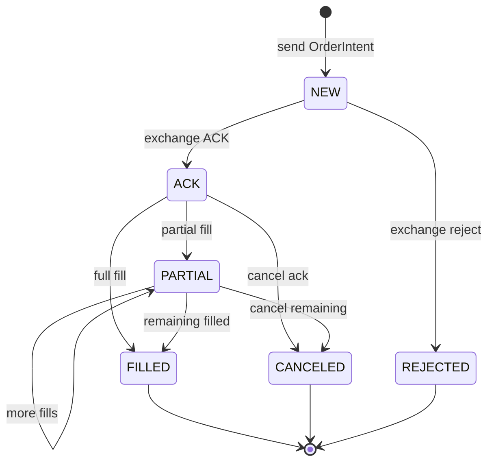
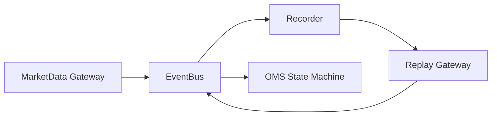

# Crypto Trading System

## 第一步的实现，一个python的crypto交易系统 ---- MVP (Minimum Viable Product)

### 架构图

### 基本组件

1. MarketEvent
2. MarketDataGateway (Binance WS)
3. OrderGateway (REST 下单 + user data stream 回报)
4. EventBus (先用python queue实现)
5. OMS (订单状态机 + intent_id 映射)
6. Risk (max_pos/max_qty/rate_limit)
7. Recorder + Replay (append-only log)
8. Latencty metrics (p50/p99: tick->decision->send->fill)

### MarketEvent

为什么交易系统必须是事件驱动？

1. 交易系统的输入是异步的（行情、回报、风控信号不会同时到）。
2. 事件驱动能够把系统拆成对外部变化的响应，而不是函数调用顺序。
3. 事件是可记录的、可回放的，这是可复现性的基础。
4. 事件模型允许系统在断线、重启后恢复状态。
5. 非事件驱动的系统很难解释“为什么下了这笔单”。

### 骨架 + Recorder

### MarketDataGateway

market data websocket 总流程 flow chart (连接 -->  消费 --> 断线 --> 重连):

_consume 细节

断网事故演练

行情不能假设连续、有序，因为接收到的只是交易所通过网络推送的观察结果。
网络会断、会抖，WebSocket 不保证补发，也不保证顺序。
因此在MarketData Gateway 里，断网重连会导致接收时间戳出现断层，而这并不对应真实市场的停顿。
因此，交易系统只能以事件（event）为基本单位，通过状态机来容忍缺失、乱序和重复，而不能依赖连续、有序的数据假设。

### Recorder & Replay

> Replay 比回测更重要，因为 replay 复现的是“系统行为”, 而回测只验证“策略假设”。在真实交易中，亏钱往往来自系统行为错误，而不是策略公式错误。

Replay 是可解释性（Explainability）的技术基础。

> 回测主要验证策略在理想化市场条件下是否赚钱，但真实交易的风险更多来自于系统行为本身。Replay 用真实行情事件作为输入，复现断线、重连、时间戳间隔和顺序变化，验证系统在真实条件下的行为一致性。如果同一份事件在 replay 和 live 下产生不同行为，那说明系统存在 bug，而不是市场变化。因此，在交易系统工程中，replay 比 backtest 更重要，是复现和可演进的基础。

> Replay is for correctness, backtest is for profitability. A system that can't replay can't be trusted.

### Event Bus
> EventBus 是单线程的事件队列，系统里的所有模块都只通过它交换事件。

如果不用EventBus，只有一条路径，(强绑定，单路)如果要拓展新的模块（比如Strategy，Metrics，Risk...）就要改MarketDataGateway（可能有多个）
Gateway 知道所有下游，加模块要改GW，GW变胖，可维护性差。

用了 EventBus 之后，Gateway 只连接 Bus，Bus 决定事件流向，下游模块互不认识。
Gateway只知道 Bus，加模块只需要subscribe。

一些关键的问题：
- 为什么Gateway不应该直接调用Recorder？
	- 因为Gateway的职责是接入外部市场，只负责publish event，recorder是系统内部的一个消费者，Gateway不应该知道任何内部模块的存在，谁来消费不关Gateway的事情。
	- 如果Gateway直接调用recorder，会导致耦合，一旦新增Strategy，Metrics，Risk等模块，就需要不断改Gateway
- 如果handler很慢，会导致什么？
	- 因为EventBus目前是单线程分发，任意一个handler变慢，整个事件流会被拖慢，queue会开始积压，最终导致内存压力甚至OOM
	- 因果链：handler慢 --> 单线程分发被阻塞 --> producer 继续 publish --> queue 积压 --> latency 飙升 / OOM
- queue慢了怎么办？为什么必须有策略
	- 考虑：市场可以无限快，内存是有限的，延迟堆积比丢数据更危险
	- 所以策略选项：
		- drop newest
		- drop oldest
		- block producer（危险）
		- spill to disk（复杂）
- 为什么replay不应该知道recorder的存在
	- 因为replay和live必须是可替换的event source。
	- replay只负责emit event，至于谁接，必须交给EventBus
- 如果以后加Strategy/OMS，需要改Gateway吗
	- 不需要。Strategy/OMS是事件消费者，只需要订阅EventBus，Gateway只面向event，不面向模块。拓展系统能力，不修改事件源。
总结：
> EventBus的作用，是让系统里的事件流动起来。
> Gateway只负责产生事件，不负责处理。职责仅仅是产生MarketEvent并publish到EventBus。
> Replay和live是等价的事件源。
> 单线程保证顺序和状态安全。
> queue满说明系统过载，必须有丢弃或限流策略。
> 新功能只能通过订阅事件拓展，而不能修改Gateway。

### OMS State Machine (core)

> 交易不是一次动作，而是一段不可靠、可能乱序、可能重复的过程；
> 只有状态机，才能在不可靠输入下保证系统行为正确。

下单不等于成交，而是：
1. 我发了一个下单意图
2. 交易所可能收到了
3. 交易所可能回了ACK
4. 成交可能分多次会来
5. 回报可能乱序、重复、延迟
6. 中途可能撤单、拒单、断线

状态机解决的问题是：当前状态下，收到这个事件，系统应该怎么做才是对的？

同时同一段market + order回放，OMS状态庄毅必须一模一样，否则说明系统逻辑有bug。

每一个箭头，都是当前状态下允许的唯一反应。

关键的事故处理：
- 乱序：FILLED可能先于ACK
- 重复：同一个 fill 回3次
- 延迟：cancel 很晚才到
而 OMS 状态机需要满足：无论 Event 怎么来，最终状态都是对的，而且不会 double count。

> OMS 不是发单模块，而是交易系统的事实引擎；
> OMS 用状态机把不可靠的外部回报，约束成可靠的内部状态。

之前部分的小总结：

#### OMS idempotency（幂等性）
> OMS 的幂等性意味着：
> 同一笔”外部事实“来一次和来一百次，
> 系统内部状态的结果完全一样。

为什么这个必须做呢？
> 所有重要消息，都是“至少一次”投递，而不是“恰好一次“。
- ACK 可能发两次
- FILL 可能重新发
- 断线重连后，旧消息可能再来一遍。
所以为了防止bug，OMS必须能够处理这些重复消息。

问题：
1. 为什么“函数调用”不需要幂等，而“外部事件处理”必须？
2. 如果我删掉 processed 集合，哪些测试会立刻失败？
3. 幂等和“状态机”是什么关系？谁解决什么问题？

| 问题             | 由谁解决 |
| -------------- | ---- |
| 这个事件在当前状态下是否合法 | 状态机  |
| 这个事件是不是已经处理过   | 幂等   |
| ACK之后还能不能FILL  | 状态机  |
| 同一个FILL能不能计算两次 | 幂等   |
| FILL先于ACK合不合法  | 状态机  |
| 重复ACK会不会破坏状态   | 幂等   |

    这是两个正交的维度。
    - 状态机决定了“事件是否应该生效” ———— 决定“方向正确”
    - 幂等决定“事件有没有已经生效过”。———— 决定“次数正确”

### 接 user data stream + 真回报 (可选 testnet)

### 风控 + 限速

### 总结

### Appendix A. Logging

为了解释系统行为，打log，但是记录所有发生的事情，log会过多。

开发 MD Gateway 的时候，打log记录：
- connect / connected
- disconnect / reconnect
- warn / error 异常
- session 关键状态变化