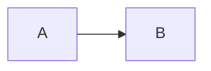

# Evolution of Observer Pattern in HFT Scearios

## Problem Statement: Optimizing Observer Pattern for Ultra-Low Latency

1. Target Latency: < 50ns per notification

2. Current Baseline: Refactoring Guru's virtual-function based implementation.

3. Critical Questions: 

    - Q1: Why is `std::list<Observer*>` problematic for cache prefetching?

    - Q2: Can we eliminate the `vtable` lookup overhead using C++ Templates?

    - Q3: How to handle Observer registration without dynamic memory allocation?

4. Hardware Assumption:
    Aliyun cloud server 2 core (vCPU) 2 GiB

```
Architecture:             x86_64
  CPU op-mode(s):         32-bit, 64-bit
  Address sizes:          46 bits physical, 48 bits virtual
  Byte Order:             Little Endian
CPU(s):                   2
  On-line CPU(s) list:    0,1
Vendor ID:                GenuineIntel
  Model name:             Intel(R) Xeon(R) Platinum
    CPU family:           6
    Model:                85
    Thread(s) per core:   2
    Core(s) per socket:   1
    Socket(s):            1
    Stepping:             4
    BogoMIPS:             4999.99
    Flags:                fpu vme de pse tsc msr pae mce cx8 apic sep mtrr pge mca cmov pat pse36 cl
                          flush mmx fxsr sse sse2 ss ht syscall nx pdpe1gb rdtscp lm constant_tsc re
                          p_good nopl xtopology nonstop_tsc cpuid tsc_known_freq pni pclmulqdq ssse3
                           fma cx16 pcid sse4_1 sse4_2 x2apic movbe popcnt tsc_deadline_timer aes xs
                          ave avx f16c rdrand hypervisor lahf_lm abm 3dnowprefetch pti fsgsbase tsc_
                          adjust bmi1 avx2 smep bmi2 erms invpcid avx512f avx512dq rdseed adx smap c
                          lflushopt clwb avx512cd avx512bw avx512vl xsaveopt xsavec xgetbv1 xsaves a
                          rat
Virtualization features:  
  Hypervisor vendor:      KVM
  Virtualization type:    full
Caches (sum of all):      
  L1d:                    32 KiB (1 instance)
  L1i:                    32 KiB (1 instance)
  L2:                     1 MiB (1 instance)
  L3:                     33 MiB (1 instance)
NUMA:                     
  NUMA node(s):           1
  NUMA node0 CPU(s):      0,1
Vulnerabilities:          
  Gather data sampling:   Unknown: Dependent on hypervisor status
  Itlb multihit:          KVM: Mitigation: VMX unsupported
  L1tf:                   Mitigation; PTE Inversion
  Mds:                    Vulnerable: Clear CPU buffers attempted, no microcode; SMT Host state unkn
                          own
  Meltdown:               Mitigation; PTI
  Mmio stale data:        Vulnerable: Clear CPU buffers attempted, no microcode; SMT Host state unkn
                          own
  Reg file data sampling: Not affected
  Retbleed:               Vulnerable
  Spec rstack overflow:   Not affected
  Spec store bypass:      Vulnerable
  Spectre v1:             Mitigation; usercopy/swapgs barriers and __user pointer sanitization
  Spectre v2:             Mitigation; Retpolines; STIBP disabled; RSB filling; PBRSB-eIBRS Not affec
                          ted; BHI Retpoline
  Srbds:                  Not affected
  Tsx async abort:        Not affected
  Vmscape:                Not affected
```

> 这个CPU硬件参数意味着什么？哪些参数对于性能在哪个角度有影响？？？



## How to measure performance & correctness? perf, TSAN

### Perf 指标

#### branch-misses / branches

#### instructions / notify

#### 对比 虚函数 vs CRTP

### TSAN